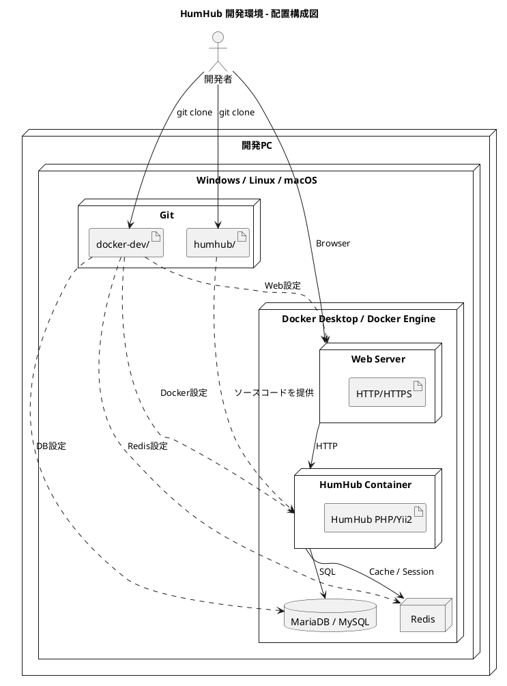
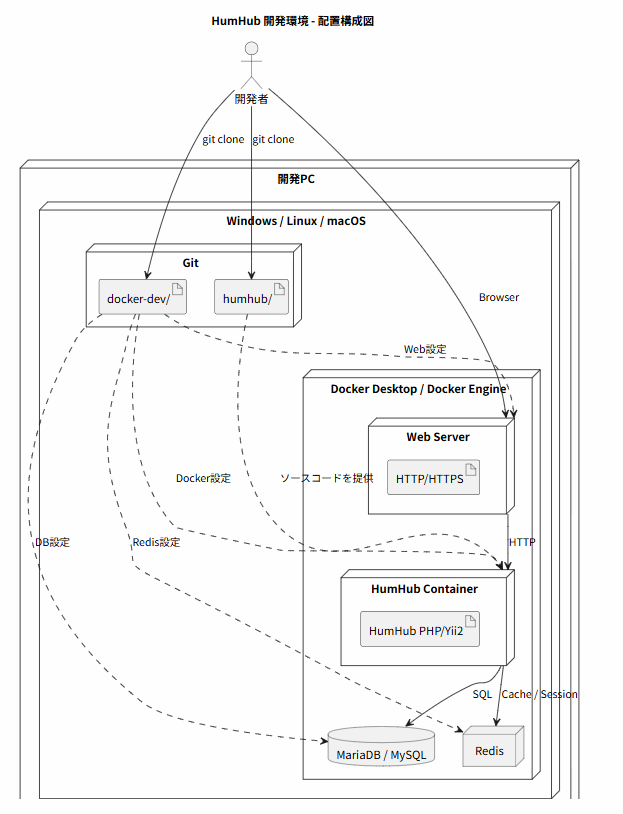
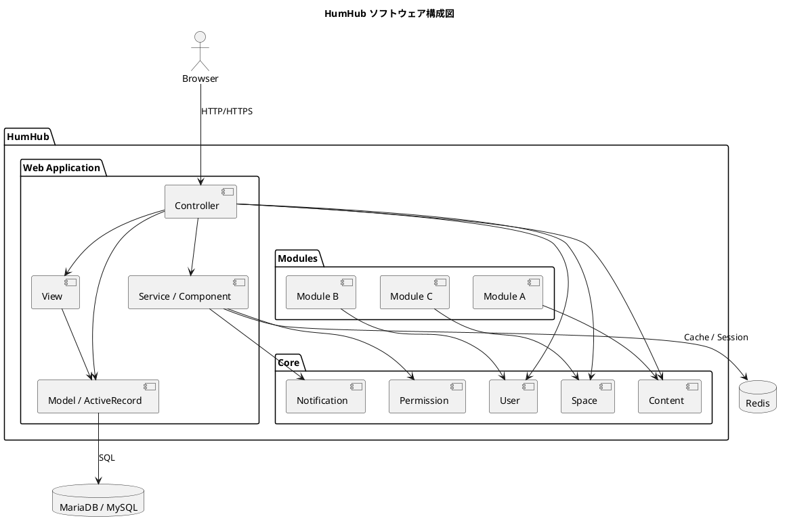
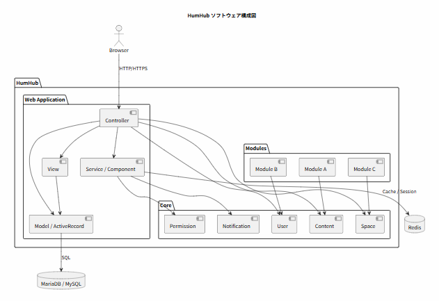
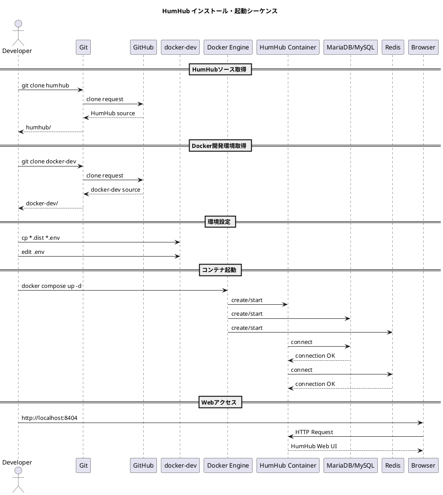

# Q1 インストールしたところまでの情報をUMLで整理するためにplantuml３つのの３つの図を作成してください。
A1 by chatgpt
はい。今の段階では、**「HumHubをGit cloneして、Docker開発環境を使ってインストールする」まで**を整理するのがよいと思います。

PlantUMLは次の3種類に分けると、かなり見通しがよくなります。

1. **配置・環境構成図** — 何がどこにあるか
2. **ソフトウェア構成図** — HumHubとDocker関連の構成
3. **インストール・起動シーケンス図** — どの順番で何を実行するか

---

# 1. 配置・環境構成図

まず、今回のPC上に何が存在するかを整理します。






この図のポイントは、

```text
開発PC
 ├── humhub/
 │     └── HumHub本体
 │
 ├── docker-dev/
 │     └── 開発用Docker設定
 │
 └── Docker
       ├── HumHub
       ├── MariaDB/MySQL
       ├── Redis
       └── Web Server
```

という関係です。

---

# 2. ソフトウェア構成図

次は「HumHubそのもの」を中心にして整理します。





これは、今後**「HumHubを参考に社内SNSを自作する」**ときに特に重要な図になります。

例えば自作SNSでは、

```text
User
Department
Project
Post
Comment
Like
Notification
Permission
File
```

などに置き換えていけます。

---

# 3. インストール・起動シーケンス図

最後は、今回実際に行った操作を時系列で整理します。



![install(./install.png)

---

## 3枚を並べると

この3枚は、それぞれ役割が違います。

```text
        ① 配置構成図
             │
             ▼
      「何がどこにある？」
             │
             ▼
        ② 構成図
             │
             ▼
      「ソフトウェアは
       どう分かれている？」
             │
             ▼
        ③ シーケンス図
             │
             ▼
      「どうやって起動する？」
```

この順番で見ると、HumHubの理解がかなりしやすくなります。

### 次の一歩

そして次は、**HumHubのソースコードを実際に読んで、**

```text
humhub/
├── protected/
│   ├── models/
│   ├── controllers/
│   ├── components/
│   └── modules/
├── themes/
├── static/
└── ...
```

を調べて、**「HumHubのパッケージ図」→「User/Space/Contentのクラス図」→「ログイン処理のシーケンス図」**の3枚を作ると、単なるインストール手順から一気に**設計解析**へ進められます。

特に小川さんの場合は、最終的にこのHumHubのUMLを**PlantUMLで再現し、それをベースに「自作社内SNS」のUMLへ変換する**流れがかなり相性がよいと思います。
