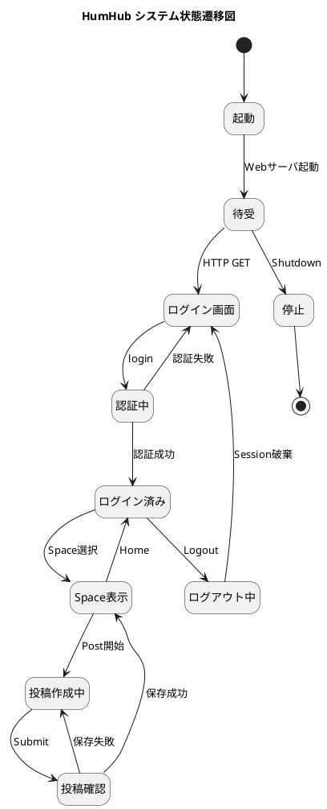
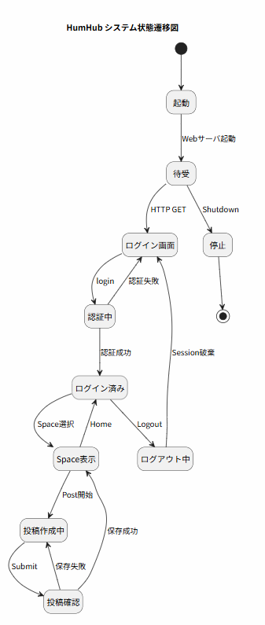
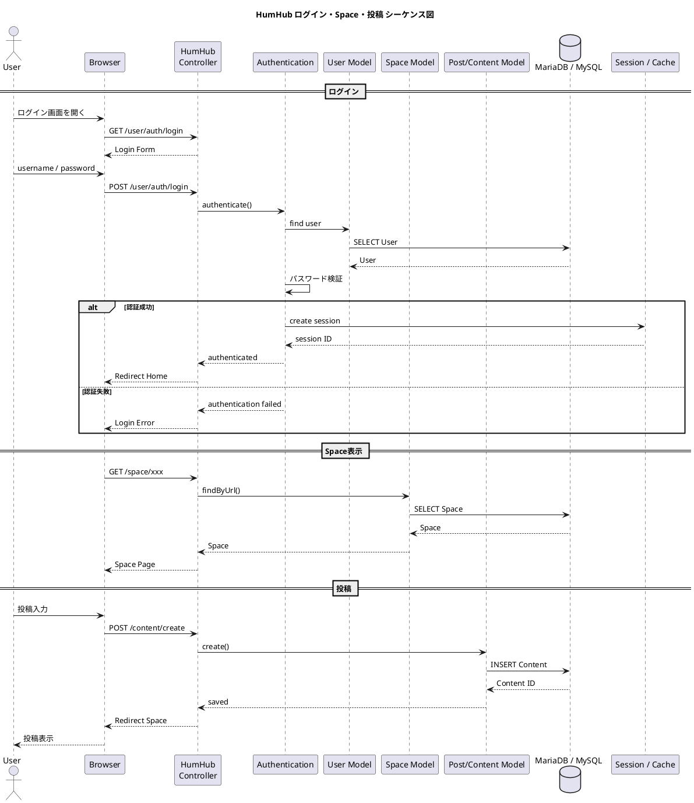
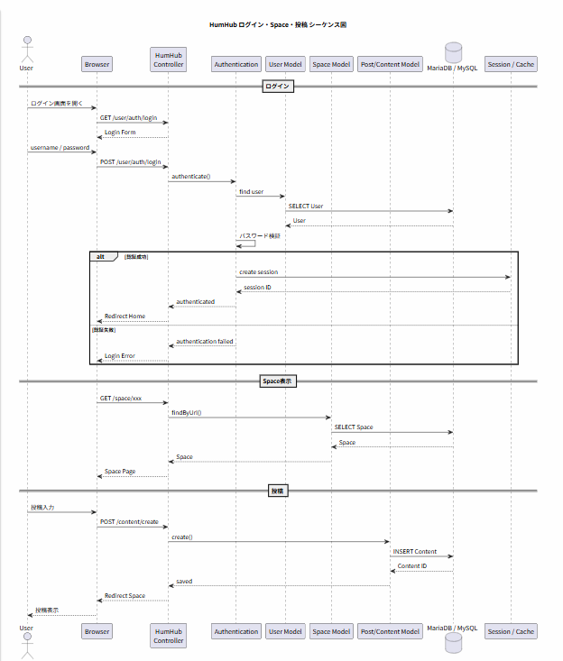
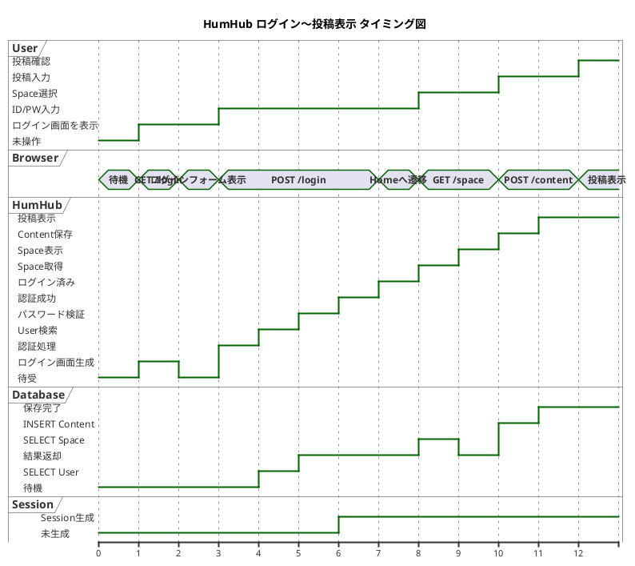

# Q1 humhumを分析するためにあるとよい、システムの状態遷移図、シーケンス図、タイミング図をすくなくとも１つづつ作成してください。
A1 by chatgpt
はい。HumHubを**「使う」のではなく、ソースコードを分析して自作の社内SNS設計に活かす**のであれば、まず次の3種類を作るのがよいです。

今回は対象を明確にするため、以下のシナリオに絞ります。

> **ユーザーがログインし、Spaceを開き、投稿を作成する**

この一連の処理なら、HumHubの **認証・Space・Content・DB・Webアプリケーション**の関係をかなり把握できます。

---

# 1. システム状態遷移図

まず、HumHubを「ユーザーから見たシステム」としてモデル化します。





### この図で見るべきところ

HumHubの分析では、特に、

```text
ログイン画面
    ↓
認証中
    ↓
ログイン済み
    ↓
Space表示
    ↓
投稿作成中
    ↓
投稿確認
    ↓
Space表示
```

という**ユーザー操作による状態変化**を追うとよいです。

さらにソースコードを調べるときは、それぞれの状態に対応する、

* Controller
* Action
* Model
* Service
* Database

を対応付けていきます。

---

# 2. ログイン→Space→投稿のシーケンス図

次は、同じシナリオを「誰と誰が通信するか」で表します。





これはHumHubをソース解析するときにかなり重要です。

例えば、

```text
Browser
   ↓
Controller
   ↓
Authentication
   ↓
User Model
   ↓
Database
```

という経路を実際のPHPコードと照合します。

その後、

```text
Browser
   ↓
Controller
   ↓
Space
   ↓
Database
```

さらに、

```text
Browser
   ↓
Controller
   ↓
Content
   ↓
Database
```

を調べます。

つまり、**UMLのメッセージを実際のPHPのクラス・メソッドに対応付ける**わけです。

---

# 3. ログインから投稿表示までのタイミング図

最後に、同じ処理を「時間軸」で見ます。



---

# 3つの図の役割

この3枚をセットにすると、HumHubの分析がかなり整理できます。

| UML    | 見るもの        | HumHub分析で調べる対象                    |
| ------ | ----------- | --------------------------------- |
| 状態遷移図  | **状態**      | Login / Home / Space / Content    |
| シーケンス図 | **処理・呼出関係** | Controller / Model / Service / DB |
| タイミング図 | **時間的な変化**  | HTTP → PHP → DB → Response        |

特に今回の目的なら、私は次のように**実装との対応表**を作ることをおすすめします。

```text
UML
 │
 ├─ 状態
 │    └─ Login
 │
 ├─ シーケンス
 │    └─ Controller
 │          └─ Action
 │
 ├─ クラス
 │    └─ User
 │          └─ ActiveRecord
 │
 └─ DB
      └─ user
```

そして次の段階では、**HumHubの実際のソースコードを見ながら、この3つを「推測図」から「実装に対応した図」に書き換える**のがよいです。

特に最初の解析対象としては、**Login → User → Session**を選ぶと、HumHubの `Controller / Model / Service / Session / DB` の関係を一通り追えるので、その後の **Space → Post → Comment → Notification** の解析にもつながります。
