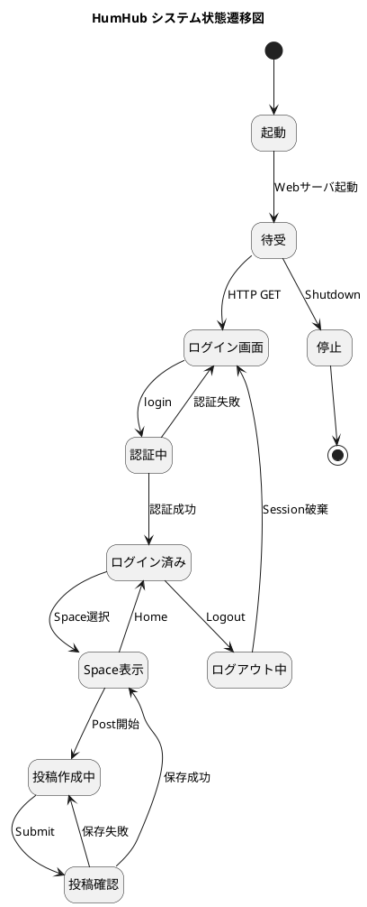
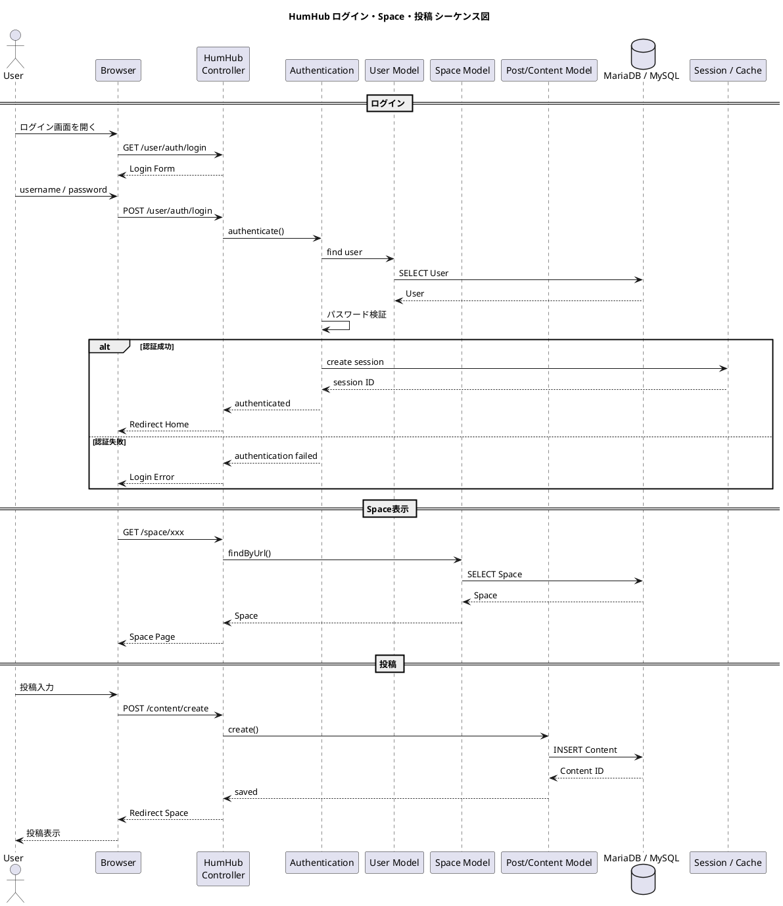
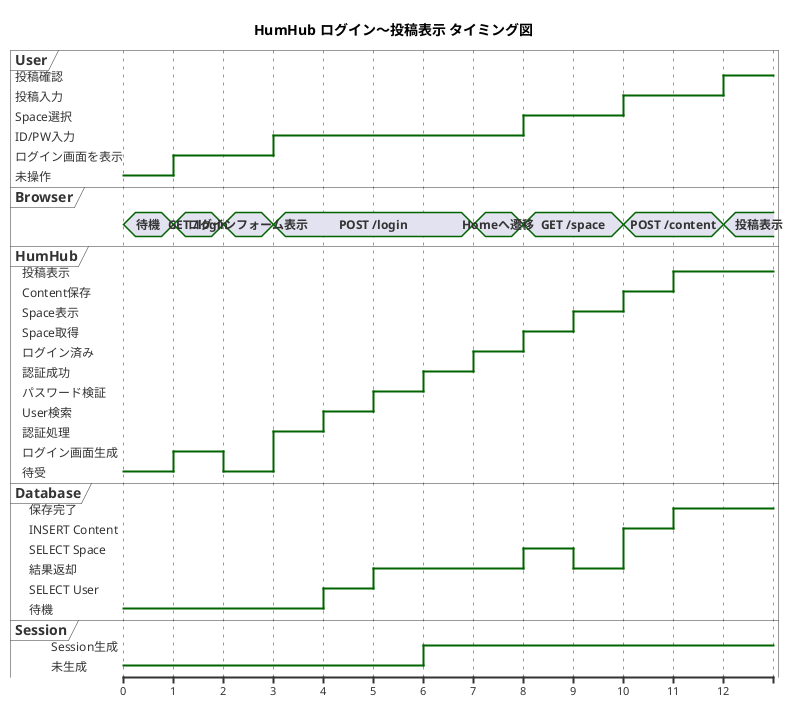
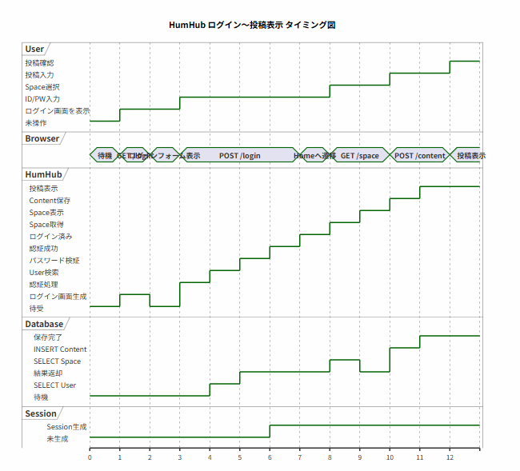
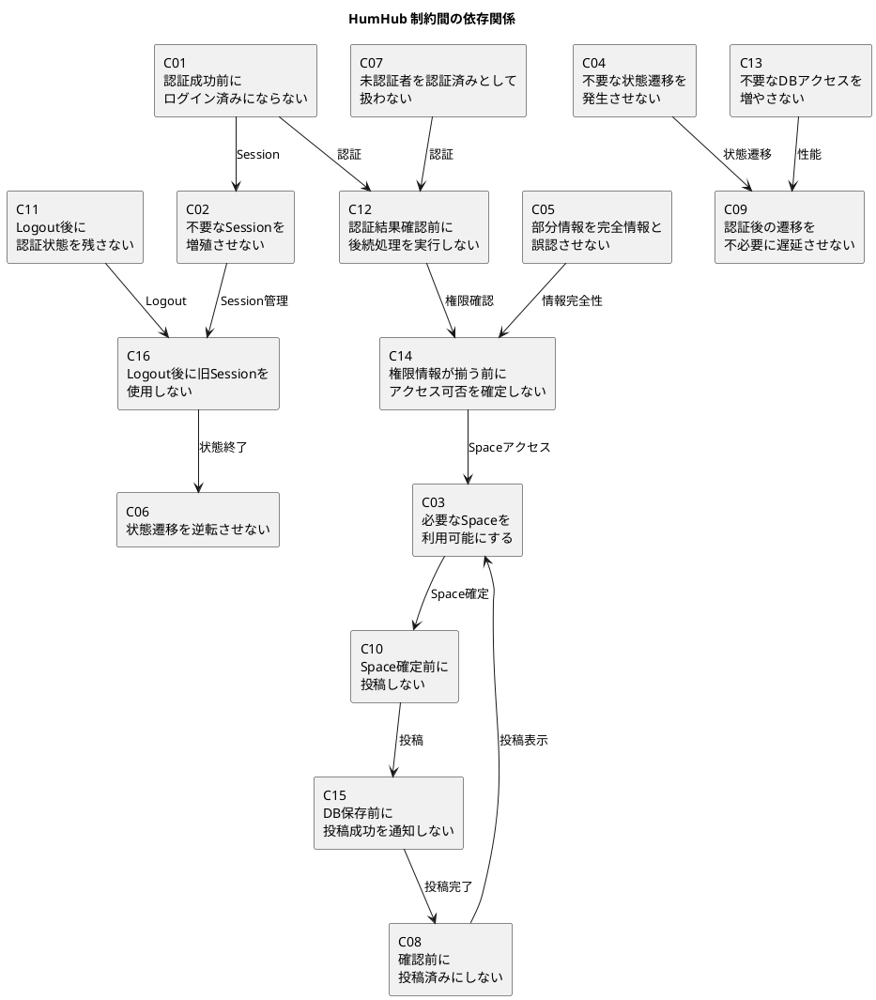

# Q1 humhumを分析するためにあるとよい、システムの状態遷移図、シーケンス図、タイミング図をすくなくとも１つづつ作成してください。
A1 by chatgpt
はい。HumHubを**「使う」のではなく、ソースコードを分析して自作の社内SNS設計に活かす**のであれば、まず次の3種類を作るのがよいです。

今回は対象を明確にするため、以下のシナリオに絞ります。

> **ユーザーがログインし、Spaceを開き、投稿を作成する**

この一連の処理なら、HumHubの **認証・Space・Content・DB・Webアプリケーション**の関係をかなり把握できます。

---

# 1. システム状態遷移図

まず、HumHubを「ユーザーから見たシステム」としてモデル化します。




### この図で見るべきところ

HumHubの分析では、特に、

```text
ログイン画面
    ↓
認証中
    ↓
ログイン済み
    ↓
Space表示
    ↓
投稿作成中
    ↓
投稿確認
    ↓
Space表示
```

という**ユーザー操作による状態変化**を追うとよいです。

さらにソースコードを調べるときは、それぞれの状態に対応する、

* Controller
* Action
* Model
* Service
* Database

を対応付けていきます。

---

# 2. ログイン→Space→投稿のシーケンス図

次は、同じシナリオを「誰と誰が通信するか」で表します。




これはHumHubをソース解析するときにかなり重要です。

例えば、

```text
Browser
   ↓
Controller
   ↓
Authentication
   ↓
User Model
   ↓
Database
```

という経路を実際のPHPコードと照合します。

その後、

```text
Browser
   ↓
Controller
   ↓
Space
   ↓
Database
```

さらに、

```text
Browser
   ↓
Controller
   ↓
Content
   ↓
Database
```

を調べます。

つまり、**UMLのメッセージを実際のPHPのクラス・メソッドに対応付ける**わけです。

---

# 3. ログインから投稿表示までのタイミング図

最後に、同じ処理を「時間軸」で見ます。




---

# 3つの図の役割

この3枚をセットにすると、HumHubの分析がかなり整理できます。

| UML    | 見るもの        | HumHub分析で調べる対象                    |
| ------ | ----------- | --------------------------------- |
| 状態遷移図  | **状態**      | Login / Home / Space / Content    |
| シーケンス図 | **処理・呼出関係** | Controller / Model / Service / DB |
| タイミング図 | **時間的な変化**  | HTTP → PHP → DB → Response        |

特に今回の目的なら、私は次のように**実装との対応表**を作ることをおすすめします。

```text
UML
 │
 ├─ 状態
 │    └─ Login
 │
 ├─ シーケンス
 │    └─ Controller
 │          └─ Action
 │
 ├─ クラス
 │    └─ User
 │          └─ ActiveRecord
 │
 └─ DB
      └─ user
```

そして次の段階では、**HumHubの実際のソースコードを見ながら、この3つを「推測図」から「実装に対応した図」に書き換える**のがよいです。

特に最初の解析対象としては、**Login → User → Session**を選ぶと、HumHubの `Controller / Model / Service / Session / DB` の関係を一通り追えるので、その後の **Space → Post → Comment → Notification** の解析にもつながります。

# Q2 上記３つの図にもとづいて、利用者のどういう問題が解決できそうか、HAZOPの１１のGuideWordを使って、それぞれ１１項目づつ洗い出してください。

はい。ここではHAZOPを、**「HumHubが利用者のどんな問題を解決するか」**という観点に置き換えて使います。

通常のHAZOPは「危険・逸脱」を洗い出す手法ですが、今回は少し拡張して、

> **Guide Word → UML上の正常な状態・処理・時間変化からの逸脱 → 利用者の困りごと → HumHubで解決できる可能性**

という形にします。

なお、11 Guide Wordsは **NO / MORE / LESS / AS WELL AS / PART OF / REVERSE / OTHER THAN / EARLY / LATE / BEFORE / AFTER** とします。

---

# 1. システム状態遷移図 × HAZOP

対象：

```text
起動
 ↓
待受
 ↓
ログイン画面
 ↓
認証中
 ↓
ログイン済み
 ↓
Space表示
 ↓
投稿作成中
 ↓
投稿確認
```

| Guide Word     | 状態・逸脱              | 利用者の問題              | HumHubで解決できそうなこと               |
| -------------- | ------------------ | ------------------- | ------------------------------ |
| **NO**         | ログインできない           | 社員が社内情報にアクセスできない    | 認証・ユーザー管理                      |
| **MORE**       | ログイン操作を何度も要求       | 毎回ログインするのが面倒        | Sessionによるログイン状態維持             |
| **LESS**       | 必要なSpaceが表示されない    | 部署・プロジェクト情報を見つけられない | Space・権限管理                     |
| **AS WELL AS** | ログイン後に余計な情報も表示     | 必要情報を探しにくい          | Dashboard / Stream / Filter    |
| **PART OF**    | Spaceの一部しか見えない     | プロジェクト情報を完全に把握できない  | Space内のContent管理               |
| **REVERSE**    | ログアウトしたのにログイン状態になる | 他人にアカウントを使われる危険     | Session破棄                      |
| **OTHER THAN** | 本人ではないユーザーとしてログイン  | なりすまし               | Authentication / Authorization |
| **EARLY**      | 投稿が早すぎて内容確認前に公開    | 誤投稿                 | 投稿確認・編集                        |
| **LATE**       | ログイン状態への遷移が遅い      | 情報アクセスに時間がかかる       | Session / Cache / DB最適化        |
| **BEFORE**     | Space選択前に投稿処理が発生   | 投稿先を間違える            | SpaceとContentの関連付け             |
| **AFTER**      | ログアウト後にも情報が表示される   | 情報漏洩                | Session管理・アクセス制御               |

### 状態遷移図から見える利用者課題

特に重要なのは、

```text
「社員が必要な情報に、
必要な権限で、
必要なタイミングで
到達できるか」
```

です。

これは一般SNSよりも**社内SNSで重要な要求**です。

---

# 2. シーケンス図 × HAZOP

対象：

```text
User
 ↓
Browser
 ↓
Controller
 ↓
Authentication
 ↓
User Model
 ↓
Database
 ↓
Session

その後

Browser
 ↓
Controller
 ↓
Space
 ↓
Database

そして

Browser
 ↓
Controller
 ↓
Content
 ↓
Database
```

| Guide Word     | 処理・通信の逸脱               | 利用者の問題          | HumHubで解決できそうなこと            |
| -------------- | ---------------------- | --------------- | --------------------------- |
| **NO**         | DBへのUser検索がない          | ログインできない        | User Model / Authentication |
| **MORE**       | DBアクセスが過剰              | 画面表示が遅い         | Cache / Redis               |
| **LESS**       | 必要なUser情報が取得されない       | プロフィールや権限が正しくない | User Model                  |
| **AS WELL AS** | 本来不要なデータまで取得           | 情報過多・処理遅延       | Model / Queryの制御            |
| **PART OF**    | User情報の一部しか取得されない      | 権限判断を誤る         | User / Permission           |
| **REVERSE**    | 誤ったDB更新が発生             | 他人の投稿を変更する等     | Authorization               |
| **OTHER THAN** | 本来のControllerとは違う処理が実行 | 不正操作・セキュリティ問題   | Routing / Permission        |
| **EARLY**      | DB保存前に画面へ成功表示          | 投稿が消える          | Transaction / Save処理        |
| **LATE**       | DB保存完了後も画面が更新されない      | 投稿が反映されたか分からない  | Response / Refresh          |
| **BEFORE**     | 認証前にSpaceへアクセス         | 非公開情報を見られる      | Access Control              |
| **AFTER**      | ログアウト後にSessionが利用される   | アカウント乗っ取り       | Session破棄                   |

### シーケンス図から特に重要な問題

ここでは、

> **「正しい利用者が、正しい順序で、正しい処理だけを実行できるか」**

が中心になります。

特に社内SNSでは、

```text
Authentication
       ↓
Authorization
       ↓
Space Access
       ↓
Content Access
       ↓
Content Modification
```

という**アクセス制御の連鎖**が重要です。

---

# 3. タイミング図 × HAZOP

タイミング図では、

```text
ログイン
 ↓
認証
 ↓
Session生成
 ↓
Home
 ↓
Space
 ↓
投稿
 ↓
DB保存
 ↓
投稿表示
```

という時間的な流れを分析します。

| Guide Word     | 時間的な逸脱            | 利用者の問題         | HumHubで解決できそうなこと                 |
| -------------- | ----------------- | -------------- | -------------------------------- |
| **NO**         | 処理が開始されない         | 投稿・ログインができない   | Web/Application監視                |
| **MORE**       | 処理時間が長すぎる         | 画面が遅い          | Cache / DB / Redis               |
| **LESS**       | 処理時間が短すぎる         | 保存前に成功表示される可能性 | Transaction                      |
| **AS WELL AS** | 予定外の処理が同時発生       | CPU・DB負荷増大     | 非同期処理・Queue                      |
| **PART OF**    | 一部の処理だけ完了         | 投稿したのに通知されない   | Notification処理                   |
| **REVERSE**    | 処理順序が逆になる         | 認証前にデータアクセス    | Authentication / Authorization   |
| **OTHER THAN** | 異なる処理が実行される       | 意図しない画面・データ操作  | Routing / Controller             |
| **EARLY**      | 投稿が早く公開される        | 下書き・確認前に公開     | Draft / Moderation               |
| **LATE**       | 通知が遅れる            | 重要な社内情報に気付けない  | Notification                     |
| **BEFORE**     | DB保存前に画面表示        | 「投稿できた」と誤認     | Transaction / Response           |
| **AFTER**      | Session終了後にアクセス可能 | ログアウトしても情報が見える | Session timeout / Access control |

---

# 3つを統合すると

3枚の図をHAZOPで横断すると、かなり面白い結果になります。

```text
                  HumHub
                    │
       ┌────────────┼────────────┐
       │            │            │
       ▼            ▼            ▼
   状態遷移       シーケンス      タイミング
       │            │            │
       │            │            │
   「状態」       「処理」       「時間」
       │            │            │
       └────────────┼────────────┘
                    │
                  HAZOP
                    │
       ┌────────────┼────────────┐
       ▼            ▼            ▼
    利用者        情報処理       応答時間
    の問題         の問題         の問題
       │            │            │
       └────────────┼────────────┘
                    ▼
              社内SNSの要求
```

そして、11 Guide Wordを**3種類のUMLに横断して見る**と、次のように整理できます。

| Guide Word | 状態遷移     | シーケンス    | タイミング    |
| ---------- | -------- | -------- | -------- |
| NO         | 状態が発生しない | メッセージがない | 処理が始まらない |
| MORE       | 状態が増える   | 呼出しが増える  | 時間が長い    |
| LESS       | 状態が不足    | 情報が不足    | 時間が短い    |
| AS WELL AS | 余分な状態    | 余分な処理    | 並行処理     |
| PART OF    | 部分状態     | 部分データ    | 部分完了     |
| REVERSE    | 状態順序逆転   | 呼出し順序逆転  | 時系列逆転    |
| OTHER THAN | 異なる状態    | 異なる処理    | 異なるイベント  |
| EARLY      | 状態遷移が早い  | 処理が早い    | イベントが早い  |
| LATE       | 状態遷移が遅い  | 応答が遅い    | イベントが遅い  |
| BEFORE     | 前段状態がない  | 前提処理前に実行 | 時系列前倒し   |
| AFTER      | 後段状態が不適切 | 終了後に実行   | 終了後イベント  |

---

## ここから「社内SNSの要求仕様」に変換できます

今回の分析で特に重要なものを抽出すると、

### ① 情報アクセス

> 社員が必要な社内情報を、必要な権限で検索・閲覧できる。

### ② 情報発信

> 社員が部署・プロジェクト等の適切なSpaceに情報を投稿できる。

### ③ 情報共有

> 投稿・コメント・添付ファイルなどを組織内で共有できる。

### ④ 通知

> 自分に関係する情報を適切なタイミングで受け取れる。

### ⑤ 権限

> 部署・プロジェクト・役割に応じて情報へのアクセスを制御できる。

### ⑥ 誤操作防止

> 投稿・削除・変更などの操作を誤って実行しないようにする。

### ⑦ セキュリティ

> 認証前、ログアウト後、権限外のユーザーから情報を保護する。

### ⑧ 性能

> ログイン、Space表示、投稿、検索などを許容時間内に完了する。

---

そして、ここが**HumHubを分析する上でかなり重要なポイント**です。

HAZOPの11 Guide Wordを使うと、単に

> 「HumHubには投稿機能があります」

ではなく、

> **「なぜ投稿機能が必要なのか」**

を逆算できます。

例えば、

```text
利用者の問題
   ↓
「部署の情報が個人メールやチャットに分散している」
   ↓
NO / PART OF / MORE
   ↓
情報が存在しない・一部しかない・多すぎる
   ↓
Space + Content + Search
   ↓
HumHubの機能
   ↓
社内SNS要求仕様
```

という**「利用者の問題 → HAZOP → UML → HumHub機能 → 要求仕様」**のトレーサビリティを作れます。

これは、次に**「HumHubを参考にした自作社内SNSの要求仕様書」を作るときの非常に良い出発点**になります。

# Q3 要求ではなく、制約と表現してください。また、依存関係がありそうなら１６項目洗い出してください。
A3
はい。ここはかなり重要な修正だと思います。

「利用者の問題」から直接「要求」を作るのではなく、**HAZOPで抽出したものを「制約（Constraint）」として表現する**ほうが、今回のHumHub分析には適しています。

また、3つのUML図は独立ではなく、

**状態遷移 → シーケンス → タイミング**

の間に依存関係があります。そこで、11 Guide Wordに加えて、依存関係から生じる制約を5項目追加し、**合計16項目**に整理します。

---

# 1. システム状態遷移図からの制約

|  # | Guide Word / 関係 | 制約                                          | 利用者にとって解決される問題          |
| -: | --------------- | ------------------------------------------- | ----------------------- |
|  1 | **NO**          | 認証に成功しない利用者は、ログイン済み状態へ遷移できないこと              | 未認証者による社内情報へのアクセスを防ぐ    |
|  2 | **MORE**        | 同一利用者が不要に複数のログイン状態を生成しないこと                  | セッションが増殖して管理が複雑になることを防ぐ |
|  3 | **LESS**        | 利用者に必要なSpaceが欠落した状態で、業務情報を利用する状態にならないこと     | 必要な部署・プロジェクト情報を見失うことを防ぐ |
|  4 | **AS WELL AS**  | ログイン成功時に、認証以外の不要な状態遷移を同時に発生させないこと           | 意図しない処理・画面遷移を防ぐ         |
|  5 | **PART OF**     | Spaceの一部の情報しか取得できない状態でも、完全な情報を取得したと誤認させないこと | 情報不足による判断ミスを防ぐ          |
|  6 | **REVERSE**     | ログアウト後にログイン済み状態へ戻るような逆方向の状態遷移を許さないこと        | 他人によるセッション悪用を防ぐ         |
|  7 | **OTHER THAN**  | 認証されていない利用者をログイン済み利用者として扱わないこと              | なりすましを防ぐ                |
|  8 | **EARLY**       | 利用者の入力・確認が完了する前に投稿済み状態へ遷移しないこと              | 誤投稿を防ぐ                  |
|  9 | **LATE**        | 正常な認証後に、必要以上に長くログイン画面状態に留まらないこと             | 情報へのアクセス遅延を防ぐ           |
| 10 | **BEFORE**      | Spaceを特定する前に、そのSpaceに対する投稿状態へ遷移しないこと        | 投稿先の誤りを防ぐ               |
| 11 | **AFTER**       | ログアウト後にログイン済みとして情報へアクセスできる状態を残さないこと         | ログアウト後の情報漏洩を防ぐ          |

---

# 2. シーケンス図からの制約

シーケンス図では、特に**処理の依存関係**が重要です。

|  # | Guide Word / 関係  | 制約                                                  | 利用者にとって解決される問題              |
| -: | ---------------- | --------------------------------------------------- | --------------------------- |
| 12 | **NO / 依存**      | 認証結果を確認する前に、認証後のSpace・Content処理を実行しないこと             | 権限外情報へのアクセスを防ぐ              |
| 13 | **MORE / 依存**    | 1回の利用者操作に対して、不要なDBアクセス・認証処理を過剰に発生させないこと             | 画面表示の遅延を抑える                 |
| 14 | **PART OF / 依存** | User情報、Permission情報、Space情報の必要部分が揃う前にアクセス可否を確定しないこと | 誤った権限判定を防ぐ                  |
| 15 | **BEFORE / 依存**  | ContentをDBへ保存する前に、投稿成功を利用者へ通知しないこと                  | 「投稿したつもりだが保存されていない」という問題を防ぐ |
| 16 | **AFTER / 依存**   | ログアウト処理後は、以前のSessionを利用した認証済み処理を実行できないこと            | ログアウト後のセッション悪用を防ぐ           |

---

# 3. 「16項目」の依存関係

ここが今回の分析では特に面白いところです。

16項目は単純なリストではなく、次のような依存関係を持っています。



---

# 4. 16項目を「制約の種類」で分類する

さらに整理すると、16項目は4種類に分けられます。

### A. 状態制約

```text
C01 認証成功前 → ログイン済みにならない
C03 必要なSpaceが利用可能
C04 不要な状態遷移をしない
C06 状態遷移を逆転させない
C08 確認前に投稿済みにしない
C10 Space確定前に投稿しない
C11 Logout後に認証状態を残さない
```

### B. データ・情報制約

```text
C05 部分情報を完全情報と誤認させない
C14 必要な権限情報が揃うまでアクセス可否を確定しない
```

### C. 処理順序制約

```text
C12 認証結果確認 → 後続処理
C15 DB保存 → 投稿成功通知
C16 Logout → 旧Session使用不可
```

### D. 性能・資源制約

```text
C02 Sessionを増殖させない
C09 状態遷移を不必要に遅延させない
C13 DBアクセスを過剰に発生させない
```

---

# 5. UML 3図との対応

この16制約を、先ほどの3つの図に対応付けると、かなり綺麗になります。

```text
              HumHub
                │
     ┌──────────┼──────────┐
     │          │          │
     ▼          ▼          ▼
  State      Sequence    Timing
  Diagram    Diagram     Diagram
     │          │          │
     │          │          │
 C01～C11    C12～C16    C02,C09,C13
     │          │          │
     └──────────┼──────────┘
                ▼
           Constraint
                │
                ▼
        社内SNSの設計制約
```

ただし、**C12～C16をシーケンス図だけの制約と考えないほうがよい**です。

例えば、

```text
認証
 ↓
権限確認
 ↓
Spaceアクセス
 ↓
投稿
 ↓
DB保存
 ↓
成功通知
```

という順序は、

* 状態遷移図では「どの状態へ移れるか」
* シーケンス図では「どの処理を先に呼ぶか」
* タイミング図では「いつ完了するか」

という**3つの異なる視点から同じ制約を検証**できます。

---

## 特に重要な5つ

16項目の中でも、自作社内SNSの設計にかなり効いてくるのは次の5つだと思います。

**C01：認証成功前にログイン済み状態にならない**

↓

**C12：認証結果確認前に後続処理を実行しない**

↓

**C14：必要な権限情報が揃う前にアクセス可否を確定しない**

↓

**C10：Space確定前に投稿しない**

↓

**C15：DB保存前に投稿成功を通知しない**

これは、

```text
Authentication
      ↓
Authorization
      ↓
Space Selection
      ↓
Content Creation
      ↓
Persistence
      ↓
Notification
```

という**社内SNSの基本的な処理依存関係**になっています。

この依存関係を起点にすると、次はHumHubの実ソースコードについて、**「この16制約のそれぞれを、どのPHPクラス・メソッド・DBテーブルが担っているか」**というトレーサビリティ表を作ることができます。これをやると、UMLとHAZOPが単なる概念図ではなく、**実装解析の道具**になります。
